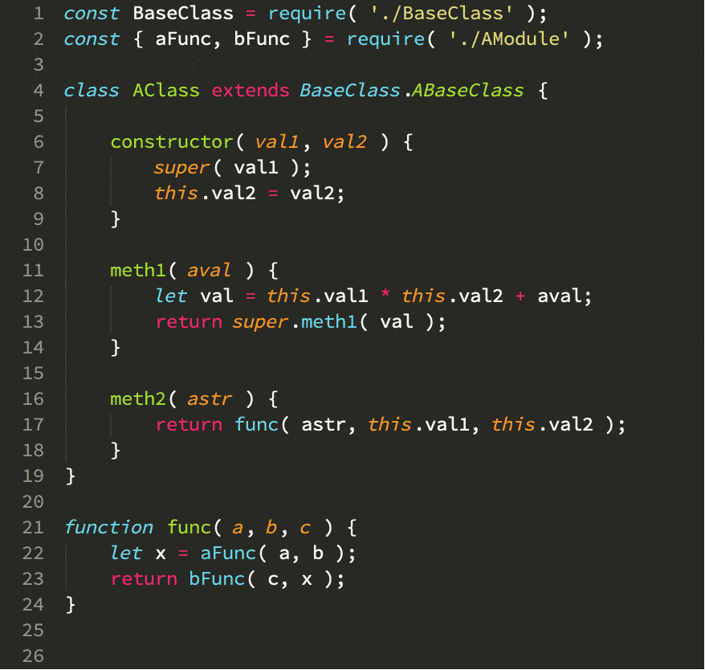

# Python-to-Javascript

Python-to-Javascript is a command-line tool which converts code written in Python into the equivalent code written in Javascript.



It is not a 100% solution. Code converted by the tool will still require some manual editing. However the conversion process - whilst imperfect - is very much faster and more accurate than doing the job by hand, and in most cases the results are very close to being usable as-is.


## Prerequisites

Python3

Consider using a [virtual environment](https://docs.python.org/3/tutorial/venv.html).


## Installing Python-to-Javascript

To install:

```
cd python-to-javascript
pip install -r requirements.txt
```

The optional end-to-end tests (see below) required [Node](https://nodejs.org/en/download/). When that is installed, do:

```
npm install

```

**NOTE**: all the following commands assume `python-to-javascript/` is your current working directory.


## Using Python-to-Javascript

To use, the following command is typical:

```
python PythonToJavascript  \
    --in_file path/to/python/file.py \
    --out_dir path/to/javascript/folder/
```
The above will result in the creation of a javascript file at:

```
path/to/javascript/folder/file.js
```

The process will not overwrite any existing destination file.

There is currently limited support for the conversion of python test code. Specifically we can convert python  unit tests which use plain asserts into javascript equivalents which use the mocha test framework and chai assertions.

```
python PythonToJavascriptForTest  \
    --in_file path/to/python/test_file.py \
    --out_dir path/to/javascript/test_folder/
```

## Features

* Python 3 => ES6
* preserves comments
* preserves blank lines
* converts these constructs:
    * classes
    * functions / methods
    * assignment (adds `let` where needed)
    * `if` / `elif` / `else`
    * `for` & `while` loops
    * `try` / `except` / `finally`
    * `and` `or` `not` => `&&` `||` `!`
    * `==` `!=` => `===` `!==`
    * `__init__( ... ):` => `constructor( ... ) {`
    * `self` => `this`
    * `super`
    * `list[ : ]` => `list.slice( ... )`
    * list comprehensions
    * dict comprehensions
    * `x is None` `x is y` ... => `x === null` `Object.is( x, y ) ...`
    * `func( a=122, b="hello" )` => `func( { a: 122, b: "hello" } )`
    * `raise NameError` => `throw new Error( 'NameError' )`

* uses a small set of functions in `_pyjs.js` to handle:
    * `getattr` / `setattr` / `hasattr`
    * `isinstance( ... )`
    * `list.zip()`
    * `string % ( ... )`

* flags these constructs as needing manual intervention
    * decorators
    * `import` statements
    * `except ( ... ) ...` => `catch( e ) /* ( ... ) */`

* the following are currently not handled
    * `new` for object instantiation
    * rewrting signatures of functions called with keyword arguments
    * static data & methods
    * `async`
    * generators

Any code not explicitly targeted by the conversion process is passed through unchanged.


## Testing


### Unit Tests

To run the tests for the main PythonToJavascript converter
```
python -m pytest --tb=native -s -v test-unit/PythonToJavascript
```

To run the tests for the PythonToJavascriptForTests converter
```
python -m pytest --tb=native -s -v test-unit/PythonToJavascriptForTests/
```

NB the results confirmed by these unit tests are not expected to be 100% correct javascript. Usually we are looking for specific changes made to aspects of the incoming code, not the code in its entirety.


### End-To-End Tests

The end-to-end tests are intended to verify that that output of converted javascript code is identical to that produced by the original python code.

To that end there are 2 directories in `test-e2e`:

* `python` In here we have simple test files that confirm the output of various operations
* `javascript` In here we have converted versions of the files in the `python` directory

To confirm that the source e2e python tests pass:
```
python -m pytest --tb=native -s -v test-e2e/python/
```

Then to convert these files to their javascript equivalents:

```
python test-e2e/convert_tests_from_python_to_javascript.py
```

Then to run the converted javascript tests:

```
npm run-script test
```

Note that in some case the resultant javascripts will fail without some minor hand adjustments which are flagged in comments.


### Testing Converted code

Ideally any code you convert using the tool will also have tests and you can use the tool to convert those too.

There is limited support in `PythonToJavascriptForTests` for converting python test files to javascript equivalents (which is used for our e2e tests). The code here will:

* convert unittest classes and methods to mocha describe() / it()
* convert python asserts to chai expect() calls

This code will help if you use this particular combination of test frameworks. If not, you can use PythonToJavascript on your test files, accepting that you will likely have to do a fair amount of hand-editting of the results to make them run successfully.

Support for converting tests for other test frameworks is currently outside the scope of this project.


## How it Works

Most of the *heavy-lifting* is done by [Fissix](https://pypi.org/project/fissix/) and [Bowler](https://pypi.org/project/bowler/). The code essentially follows the bowler pattern of identifying constructs in a python syntax tree, and rewriting the nodes from which the tree is formed - but instead of writing python, our changes rewrite the code into javascript. This could be construed as something of a hack, but it works quite well.

There is a small _"compatibility"_ module `_pyjs.js` containing javascript versions of python's `attribute` builtins alongside functions introduced by the conversion process that mimic the behaviour of some python idioms.

In converting to the JS output, I've tended to just put nodes and leafs one after the other without any regard to creating a valid syntax tree. Ultimately I'm only interested in the textual output and this approach has worked.


## Background

In 2019 I had a load of Python web-server code that I realised would probably work better were it to be executed in the client. I looked at tools that would facilitate this shift of environment - either translating the code, or allowing python to run in the browser. Both kinds of available solution tended to require the use of a constrained form of python (don't use this, must use that), as well as support libraries. Whereas what I felt I really needed was a line-by-line syntax-correct translation from one language to the other.

I had previously experimented using Bowler for some simple code tidying - could I build a translator using that?

The answer turned out to be yes, and these are the results - with the following caveats:

* the tool was intended to be somewhat quick and dirty
* it was never meant to convert every possible python construct, only the ones I needed
* I always knew I'd be hand-editing the resultant converted files
* some of my personal coding preferences are *baked-in*

It successfully handled the bulk of the conversion I needed - roughly 40K lines / 100 files. I thought it might be useful for others so, after a bit of tidying up, I've finally got round to putting it here.

I don't anticipate making any major changes, but I'm happy to maintain the project for now, and will accept contributions for improvements.


## Contributing

Please see the GitHub documentation on [creating a pull request](https://help.github.com/en/github/collaborating-with-issues-and-pull-requests/creating-a-pull-request).


## Contributors

* [@majwilson](https://github.com/majwilson)


## Contact

You can contact me at <majwilson@gmail.com>.


## License
This project uses the MIT license - please see the accompanying LICENSE.txt file.

